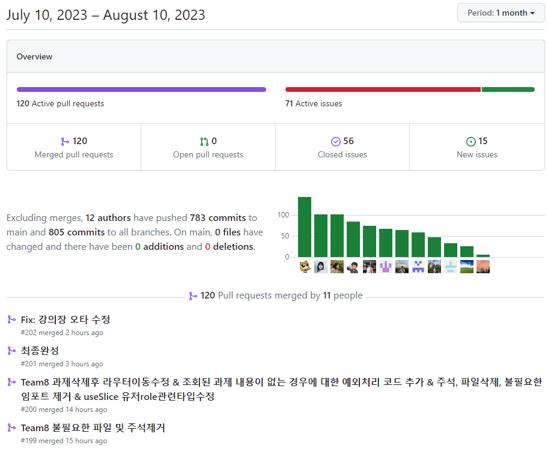

# LMS 클래스룸 수강시스템 README

# 🔗 배포 URL

[스나이퍼 팩토리](https://lms-a.sniperfactory.com/classroom)

**이메일 로그인 테스트 계정**

|  | 관리자 | 수강생 |
| --- | --- | --- |
| ID | test@test.com | test4@test.com |
| PW | test1234 | test1234 |

# 💻 프로젝트 소개

## LMS 사이트 제작

이 프로젝트는 LMS 사이트 제작으로 총 5개의 분류를 각각의 한팀씩 맡아 제작하여 최종적으로 5개의 결과물을 하나로 합치는 방식으로 진행 하였습니다.

각각의 분류는 아래와 같습니다.

1. 자체 디자인시스템 라이브러리 개발
2. 오픈소스리액트 비디오 플레이어 개발
3. 과제제출/평가시스템 제작
4. 클래스룸 수강시스템 제작
5. 커뮤니티&마이페이지 학습 진행률 시스템 제작

### 이중에서 우리 팀은 **분류 4번의 클래스룸 수강시스템 제작**을 맡아서 진행하였습니다.

4번의 클래스룸 수상시스템의 큰 기능은 아래와 같습니다.

- 관리자가 클래스 콘텐츠(강의 노트, 동영상, 링크)등을 업로드하고 수강생의 수강률 혹은 학습진행도를 기록하는 시스템 개발입니다.
- 동영상 시청, 과제 제출, 커뮤니티등의 기능을 각각 구현하여 웹기반 동영상 강의 LMS 시스템을 제작하였습니다.

<aside>
📖 **LMS란?**

학습 관리 시스템은 조직에 학습 프로세스의 모든 측면에 대한 프레임워크를 제공하는 소프 트웨어 애플리케이션입니다. 우수한 LMS 시스템은 AI와 스마트 기술을 사용하고, 다른 중요 HR 및 엔터프라이즈
관리 시스템과의 클라우드 통합을 지원합니다. LMS는 모든 학습 및 교육 컨텐츠를 저장, 제공하고 추적합니다.

</aside>

# 🤝 협업

### 5개의 분류중 3-4-5분류는 하나의 사이트 기능을 3개로 나눈 만큼 협업이 중요했습니다.

- 세팀이 하나의 사이트를 만드는 만큼 모든 팀이 이 프로젝트에 열정을 가지고 있어야 했고 하나의 팀처럼 움직여야만 했습니다. 그래서 우리 세 팀은 프로젝트 기간인 한달 동안 총 805번의 커밋을 할 정도로 열정을 쏟았습니다.

- 이슈 등록 또한 라벨링을 통해 어떤 팀이 어떤 기능을 만들고 있는지 작성했으며 이슈 내부적으로는 task를 작성하여 트래킹하기 편하게 만들었습니다.

- github의 projects를 이용한 칸반보드로 3팀이 모두 진행할 기능, 진행중인 기능, 앞으로 진행중인 기능을 알아볼 수 있도록 하였습니다.

- 3팀이 하나의 코드로 합치는 만큼 코드 컨벤션이 다르다던가 하는 여러가지 문제점이 발생할 수 있습니다. 이런 문제를 해결하고자 develop이나 main 브랜치에 팀 브랜치를 merge하는 경우 팀장들을 리뷰어로 등록하고 코드리뷰를 진행하였습니다. 이를 통해 굳이 3팀이 다 모이지 않아도 서로의 팀들 작업 상황을 트래킹 할 수 있었습니다.

.gif)

- 디스코드나 슬랙, zep, VS Code 라이브 셰어 등 협업 툴들을 사용하여서 많이 모여서 작업을 진행 하였습니다.

- 슬랙이나 zep 같은 경우는 3팀 뿐만 아니라 이 프로젝트에 참여하는 모든 팀이 모여야 하는 경우 공지를 하거나 모여서 회의를 할 때 사용하였습니다.
- 한달 안에 사이트의 모든 기능을 제작하기 위해서는 3팀이 공용 컴포넌트를 제작 해야만 했습니다. 똑같은 기능을 하는 코드를 굳이 여러번 만들지 않도록 하여 시간을 아꼈습니다. 4팀은 파일 드래그 앤 드롭을 8팀은 모달과 사이드바를 10팀은 헤더와 푸터, 로그인 기능을 담당하여 공용 컴포넌트로 만들었습니다.

- DB를 직접 설계하고 만들었습니다. 만드는 과정에서 이 프로젝트에 참여하는 모든 팀에서 DB설계자를 뽑아 일주일에 두번, 세번씩 모여 DB를 설계하였습니다. 최종적으로는 버전 6까지 나왔고 실제로 사용되는 DB도 동일한 구조를 가지고 있습니다.

- 허스키를 통하여 커밋 컨벤션을 지정하여 모두가 같은 형식으로 커밋하도록 하여서 트래킹 하기에 유용하게 진행하였습니다.
- **추가적으로 우리 4팀 끼리는 30룰을 만들어 적용 하였습니다. 30룰은 문제가 발생한 경우 혼자서 최대 30분까지 문제에 대해 고민해보고 검색해보는 룰입니다. 30분이 지나면 팀원에게 어떤 문제가 발생 했고 해결하기 위해 어떤 일을 했는지 참고한 문서는 어떤 것인지 알려주고 함께 고민 하면서 함께 해결하는 룰 입니다. 약 4주만에 프로젝트를 진행해야하는 만큼 각 개인에게 주어진 시간이 매우 짧으므로 빠르게 기능을 개발 하기위하여 도입 하였습니다. 덕분에 성공적으로 프로젝트를 끝마칠 수 있었습니다.**

### 📆 프로젝트 기간

2023년 7월 17일 ~ 2023년 8월 11일 (26일간)

# 👥 팀원 소개 및 담당 기능

불사조 팀은 3명의 팀원으로 구성되어 있습니다.

| FE 정진 (팀장) | FE 전하준 (팀원) | FE 김민지 (팀원) |
| --- | --- | --- |
| • 강의장 동영상 플레이어
• 강의장 커뮤니티
• DB 설계 | • 드래그 앤 드롭
• 강의 생성
• 강의 수정 | • 클래스룸 사이드바
• 강의실 화면 구성
• 유저 role에 따른 UI 변경 |
| GitHub:https://github.com/TypingOK | GitHub: https://github.com/Majesty-jun | GitHub: https://github.com/minzyee |

# 👩🏻‍💻 개발 환경 및 기술 스택

### 기술 스택

- **FE:** Next.js 13, TypeScript, Tailwindcss, Redux, ReactQuery
- **BE:** Firebase
- **배포:** Vercel

### 협업 툴

- **버전 관리:** Git, [GitHub](https://github.com/sniperfactory-official/sfac-lms-team-a)
- **진행 상황 관리:** [GitHub Project](https://github.com/users/sniperfactory-official/projects/6/views/2)
- **이슈관리:** [GitHub Issues](https://github.com/sniperfactory-official/sfac-lms-team-a/issues)
- **메신저:** Discord, Slack, Zep

📑 DB 설계 및 구조

[스나이퍼 DB 설계](https://app.eraser.io/workspace/kGgQYva1zAO0XZUtDvDc)

# 🎨 피그마 시안

[스나이퍼팩토리 LMS](https://www.figma.com/file/c8mYlxCSogvacib7lg3zW5/스나이퍼팩토리-LMS?type=design&node-id=3073-22180&mode=design&t=xOd2Ept3t2WdOf89-0)

# 📌 4팀 주요 기능

### 1. 강의 생성

- 강의 생성 버튼을 누르면 강의 유형을 선택하는 모달창이 나타납니다.
- 강의 유형을 선택한 후, 다음 버튼을 클릭하면 해당 유형에 맞는 강의 생성 모달창이 나타나게 됩니다.
    - 노트 강의 : 마크다운 에디터에 직접 마크다운 형식으로 텍스트를 입력할 수 있고, 사진추가 버튼을 통해서 이미지를 추가할 수 있게 구현하였습니다.
    - 영상 강의 : 드래그 앤 드롭 기능을 통하여 파일을 드래그 하여 모달창 위에 올려놓을 경우, 영상 파일이 업로드 되고, 버튼으로도 업로드 할 수 있도록 구현하였습니다.
    - 링크 강의 : 텍스트 입력 창을 통해서 링크를 입력하여 업로드 할 수 있도록 구현하였습니다.
- 강의 정보 입력 후 업로드 버튼을 클릭하면, 파일이 업로드 되는 동안 로딩 스피너가 돌고난 후 강의가 등록됩니다.

.gif)
.gif)
.gif)

### 2. 강의 수정

- 수정하고자 하는 강의의 수정 버튼을 누르면, 해당 강의 유형에 맞는 강의 수정 모달창이 나타나게 됩니다.
- 수정 완료 후, 업로드 버튼 클릭 시, 해당 강의 정보가 수정된 것을 보실 수 있습니다.

### 3. 강의 삭제

- 삭제하고자 하는 강의의 삭제 버튼을 누르면, 강의 삭제 여부 모달이 등장합니다.
- 모달의 삭제 버튼 클릭 시, 해당 강의가 삭제되는 것을 보실 수 있습니다.

### 4. 섹션 추가

- 섹션 추가 버튼을 누르면 새로운 섹션이 생성됩니다.

### 5. 섹션 수정

- 섹션 수정 버튼을 누르면 수정이 가능한 상태로 UI가 변경됩니다.
- 섹션 타이틀 변경: 섹션의 타이틀을 더블 클릭 하면 텍스트를 입력할 수 있는 인풋창으로 변경되고, 원하는 타이틀을 입력 후, Enter를 누르면 해당 변경사항이 적용됩니다.
- 섹션 및 강의 체크: 섹션 또는 강의를 체크할 수 있는 체크박스가 있습니다. 체크하고 선택 삭제를 누르면 해당 섹션 또는 강의가 삭제 됩니다.
- 강의 리스트 순서 변경: 옮기고자 하는 강의를 드래그 앤 드롭하여 순서를 변경할 수 있습니다.

### 6. 강의장 (동영상)

- 동영상 강의인 경우 동영상 플레이어가 나오게 됩니다.
- 중간에 퇴장하고 다시 들어오는 경우 듣고 있었던 지점부터 다시 재생 하게 됩니다.
    
    
    
- 커뮤니티에서 타임스탬프가 작성 되어있는 경우 클릭했을 때 해당 지점으로 이동하게 됩니다.
    
    
    

### 7. 강의장 (노트)

- 노트 형식의 강의인 경우 마크 다운 기반으로 표시하게 됩니다.

- 마크 다운 중간에 삽입된 이미지의 경우 Next/Image의 <Image />를 사용하는 방식으로 처리 하였습니다.

### 8. 강의장 (링크)

- 링크 형식의 강의인 경우 링크를 눌러 페이지 이동을 할 수 있도록 하였습니다.
    
    
    

### 9. 강의장 커뮤니티

- 강의장 커뮤니티에서는 댓글과 답글을 작성하는 기능입니다.
- 댓글을 달 때 02:31과 같이 HH:MM:SS 형식으로 글을 작성하는 경우 타임스탬프로 인식 되어 동영상 강의의 시간을 제어할 수 있습니다.
- 답글 달기를 누르거나 @멘션 기능을 이용하여 닉네임을 작성하는 경우 멘션을 달 수 있습니다.

### 10. 역할에 따른 UI 비공개 처리

- 관리자와 수강생이 접근 할 수 있는 UI를 나눠 작업했습니다.
- 관리자의 경우에만 섹션 추가, 섹션 수정의 기능을 수행할 수 있으며, 비공개 강의도 볼 수 있도록 작업했습니다.

